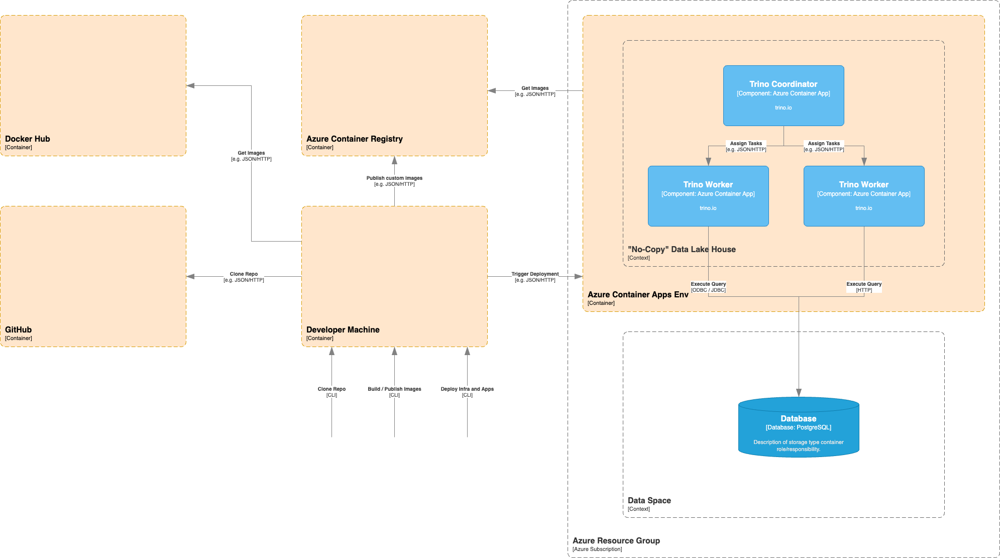

# virtual-distributed-knowledge-graph

## Deployment View



## Currently Open Tasks

- [x] First working deployment of Trino cluster with one SQL connector 
- [ ] First working deployment of ontop-vkg 
- [ ] Add further, different connectors to Trino
- [ ] Use Purview to model ontology of data present in the different data sources
- [ ] Map Purview ontology to RDF 
- [ ] Create R2RML mapping for ontop-vkg
- [ ] Connection of ontop-vkg to Trino coordinator / cluster

## Currently Open Issues

- [ ] When run for the first time an empty Azure Container Registry is created but bicep tries to deploy container apps e.g. Trino from this acr. \
  *Workaround:* Let the first infra deploy fail, build and publish container, rerun infa deployment
- [ ] The PostgreSQL database is created empty but Trino currently expects an employees_database. \
  *Workaround:* After the initial deployment of the database geht required dummy data from https://github.com/h8/employees-database and import it into the database.
- [ ] The PostgreSQL server firewall currently allows access from everywhere (0.0.0.0 - 255.255.255.255). This currently allows Trino workers and local hosts to access the database.
- [ ] The container apps currently consume the PostgreSQL password via regular container environment parameters. This should be changed to proper secrets like https://learn.microsoft.com/en-us/azure/container-apps/manage-secrets?tabs=arm-template.

## Trino

### Configuration

Trino is configured by the following means:

- *Templates* under `trino/template/` \
  Here you'll find the properties template common to all Trino nodes (trino.node.properties.template), the properties template for the coordinator (coordinator.config.properties) as well as the properties template for the worker (worker.config.properties.template).
- *Conncetors* under `trino/template/catalog` \
  Here you'll find the configuration for the different connectors configured for the cluster. \
  Each connector will have its own properties template like the postgresql.properties.template.
- *setup.sh* under `trino` \
  This script is executed by the container upon deployment, consumes environment variables and uses those to substitute template variables and to copy the template files into the proper location for Trino to use.
  The Templates use the *${VARIABLE}* pattern which is exchanged to proper values via the `envsubst` command.


### Preparing The Custom Trino Image

For this documentation it is assumed that your container registry can be found under `vdkg01pocacr.azurecr.io`. \
If that's not the case please change all the references to the correct host.

#### Building 
In the `trino` folder execute the following command to build the custom Trino image manually.

```bash
$ docker build --platform=linux/amd64 -t vdkg01pocacr.azurecr.io/trino:$(date +"%Y-%m-%d_%H-%M-%S") .
```

This will create an image like the following `vdkg01pocacr.azurecr.io/trino:2022-12-22_15-59-08` with the build timestamp at the end.

#### Publishing

To publish the custom Trino to the container registry execute the following command.

You might need to login to the registry at first via `docker login vdkg01pocacr.azurecr.io`

```bash
$ docker push vdkg01pocacr.azurecr.io/trino:2022-12-22_15-59-08
```

### Testing Trino

Get the command line client from https://trino.io/download.html.

Execute the following command to connect to the Trino coordinator `./trino --server https://trino-coordinator.livelyisland-145ff88b.westeurope.azurecontainerapps.io` this will give you the prompt `trino>`.

Query the dummy data with `select * from postgresql.employees.employee;`.

See the following example:
```bash
$ ./trino --server https://trino-coordinator.livelyisland-145ff88b.westeurope.azurecontainerapps.io
trino> select * from postgresql.employees.employee;
  id   | birth_date |   first_name   |    last_name     | gender | hire_date
-------+------------+----------------+------------------+--------+------------
 10001 | 1953-09-02 | Georgi         | Facello          | M      | 1986-06-26
 10002 | 1964-06-02 | Bezalel        | Simmel           | F      | 1985-11-21
 10003 | 1959-12-03 | Parto          | Bamford          | M      | 1986-08-28
 10004 | 1954-05-01 | Chirstian      | Koblick          | M      | 1986-12-01
 10005 | 1955-01-21 | Kyoichi        | Maliniak         | M      | 1989-09-12
 10006 | 1953-04-20 | Anneke         | Preusig          | F      | 1989-06-02
 10007 | 1957-05-23 | Tzvetan        | Zielinski        | F      | 1989-02-10
 10008 | 1958-02-19 | Saniya         | Kalloufi         | M      | 1994-09-15
 10009 | 1952-04-19 | Sumant         | Peac             | F      | 1985-02-18
 10010 | 1963-06-01 | Duangkaew      | Piveteau         | F      | 1989-08-24
 10040 | 1959-09-13 | Weiyi          | Meriste          | F      | 1993-02-14
 10041 | 1959-08-27 | Uri            | Lenart           | F      | 1989-11-12
:
```

Abort the query by pressing `q`, exit Trino via `exit` command.

## Infrastructure

### Deployment

Required parameters:

- *trinoImage* the custom Trino image in the container registry to deploy
- *postGresAdministratorLogin* the PostgreSQL admin username
- *postGresAdministratorLoginPassword* the PostgreSQL admin password

```bash
$ az deployment sub create --location westeurope \
    --template-file ./main.bicep \
    --parameters \
        @./parameters.dev.json \
        trinoImage='vdkg01pocacr.azurecr.io/trino:2022-12-22_15-59-08' \
        postGresAdministratorLogin='foobaruser' \
        postGresAdministratorLoginPassword='ccb86...f1fff'
```